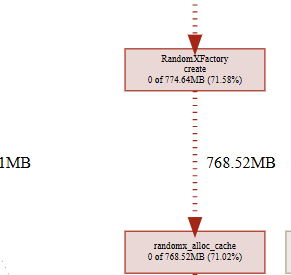
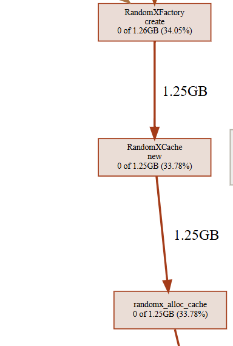
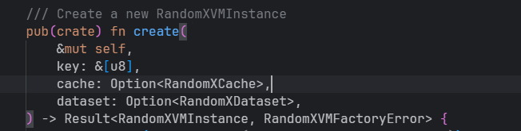
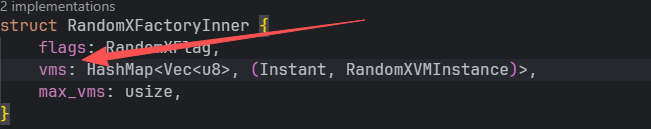
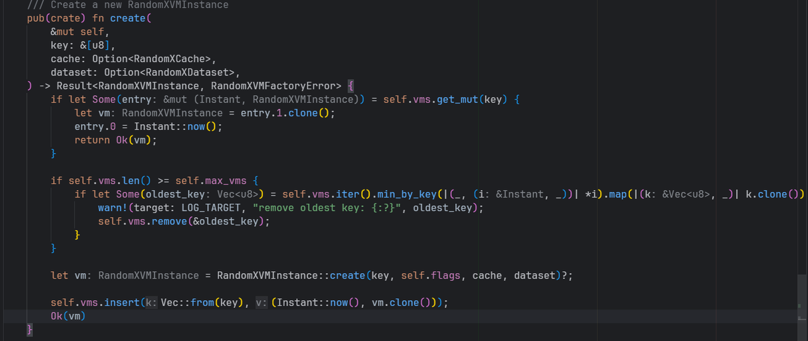
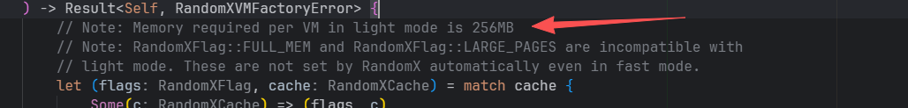
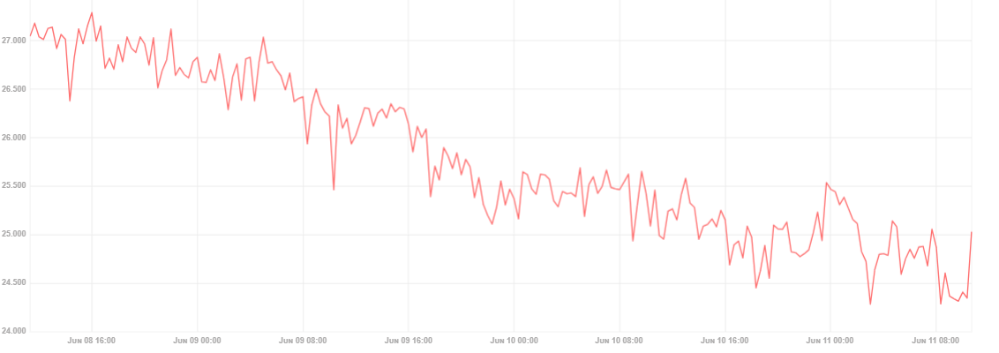

RandomxFactory::create
内存分配
前:

后：

原因:
函数位置 : randomx_factory.rs 文件

原因:

vms是hashmap，当调用此方法时，当key不相同时，就会插入一个VMInstance，这个VMInstance是256MB大小。
Monero, tari randomx 算法有关，key大概2048个块变化一次

key跟 Monero, tari randomx 算法有关，key大概2048个块变化一次。
但是，这个也是有最大限度的，map中最多也只有5个元素。所以，它仅仅会在某个时刻瞬间下降，而不是持续的下降

OutBond
内存分配

前

后

感觉跟 块 有关，同步或者出块的时候都会调用这里
调用顺序
1. outbound.rs 文件：
   /// Run the outbound pipeline.
   pub async fn run(mut self) {
2. broadcast.rs文件
   pub async fn handle(mut self) -> Result<(), PipelineError> {
3. serialize.rs 文件 序列化
   fn call(&mut self, message: DhtOutboundMessage) -> Self::Future {

ai回复
1. `tari_comms_dht::outbound::broadcast::BroadcastTask<S>::handle::{{closure}}` 这里分配的内存不断上涨，分析下为什么呢？

- **无界并发**：`call_all(...).unordered()` 会同时驱动所有目标节点的发送 Future。如果下游 service（网络发送栈/连接管理）处理速度跟不上，当前广播的所有消息 Future 会长期悬挂，新的广播继续叠加，造成在途任务、`DhtOutboundMessage`、`SendState`、oneshot 通道、日志缓冲等一起累积，RSS 逐步爬升。
- **高频广播×高扇出**：若上游产生日志/区块/交易广播很频繁，且 `select_peers` 返回的节点数多，单次峰值分配与在途保留叠乘明显。

2. 同时这里prost::message::Message::encode_to_vec 显示也在不断增大
   短答：是同一路症状。大量并发广播导致“编码任务堆积”，prost::Message::encode_to_vec 每次都会分配新 Vec，随着在途消息数升高，分配与暂存的编码缓冲也会持续增长，从而表现为内存不断上涨。

为何会涨
- **无界并发**：这里一次广播会对选中的所有节点同时发送，当前实现是无界并发：
  self.service
  .call_all(stream::iter(messages))
  .unordered()
  .filter_map(|result| future::ready(result.err()))
  .for_each(|err| { /* log */ })
  .await;
- **每条消息单独编码与分配**：下游在真正发网前，会把 `DhtOutboundMessage` 包装成 Protobuf 并调用 `prost::Message::encode_to_vec`。该 API 每次返回新 Vec，不复用缓冲。若上游广播频繁、扇出多、下游处理慢，这些编码缓冲会在大量在途 future 完成前一直占用内存。
- 消息体本身（区块、交易）可能很大；即便上层 Bytes 是零拷贝共享，下游“Protobuf 封装层”的编码仍会为每个目的节点生成独立的编码缓冲。

后续解决
经讨论，暂时未找到合适的解决方案，所以暂时进行定时重启的解决措施，然后提出issue给官方，看看官方如何更改

当前的内存泄露的直观体验

