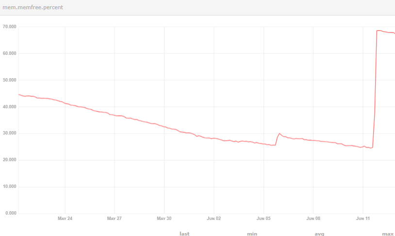
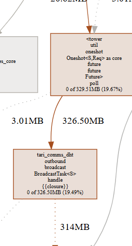
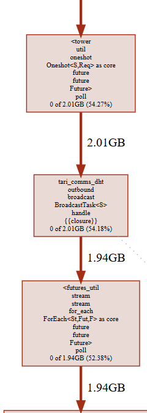

# Continuous outbound-related memory growth on a mainnet mining node

## Summary

We observed continuous memory growth on a mainnet mining base node that keeps producing blocks.

The version currently in use is: `release 5.3.0`.

The behavior is as follows: memory usage keeps increasing during node runtime and does not noticeably fall back for a long time; at the same time, the node continues to operate normally on the network, continues accepting miner-submitted blocks, and continues producing blocks.
Based on the current behavior and the profile results, we believe this issue is related to the outbound path, but we still cannot determine which specific stage is responsible for the continuous memory growth.

The overall trend is roughly as follows: as the node keeps running, available memory gradually decreases and does not noticeably recover for a long period; after restarting the node, available memory recovers immediately and significantly.



## Profiling evidence

Earlier profile:



The live memory attributed to:

```text
tari_comms_dht::outbound::broadcast::BroadcastTask<S>::handle
```

was approximately `326.50MB`.

Profile from a few days later:



The same outbound call path had increased to approximately `2.01GB`.

At the same time, around `1.94GB` was also attributed to:

```text
futures_util::stream::for_each::ForEach::poll
```

In addition, we also observed continuously growing live allocations coming from the Protobuf encoding path.

We understand that these profiles only show where the memory was originally allocated. They do not necessarily mean that these objects are still directly held by `BroadcastTask`; the encoded messages may already have moved further downstream into queues or network write futures.

## Why we suspect the outbound path

We integrated `jemalloc_pprof` to analyze memory allocation behavior. From the heap profiles, the share of live memory attributed to outbound broadcast-related call paths keeps increasing and grows noticeably over time.

Based on the current behavior, we currently suspect that the issue is mainly in the outbound path, but we still cannot fully confirm the final root cause. We would therefore appreciate help judging what category of problem this is most likely to be.

## Current preliminary assessment

The following is a preliminary assessment based on the observed behavior, profiles, code paths, and AI-assisted analysis. The exact root cause is still not fully known.

Based on the information currently available, we are more inclined to think that the issue may be in the later stages of the outbound path: messages produced by broadcast may be retained in downstream unbounded queues or in the write stage, and if one or a small number of peers stop making write progress for a long time, that retention may be amplified further, eventually showing up as continuously live memory and steady RSS growth.

This does not require all peers to be blocked. As long as a small number of peers remain slow for a long time, other peers may still receive blocks normally, which would explain how the node can continue producing blocks and the network can continue receiving them while local memory still keeps increasing.

In addition, based on the current implementation and the observed behavior, the fan-out in `BroadcastTask::handle` may amplify the number of in-flight messages produced by a single propagation round, while the existing outbound pipeline timeout does not appear to necessarily clean up messages that have already entered the per-peer messaging queue; meanwhile, the current per-peer queue and retry queue are both unbounded, and the behavior of `reply_success()` together with `Forward` also does not seem sufficient to directly show that a message has actually been written out and released in time.

## Request for upstream analysis

Based on the current profiles, runtime behavior, and code paths, we can currently only say that the issue is very likely related to the outbound path, but we still cannot determine the final root cause.

We would appreciate it if the maintainers could help analyze the current implementation and advise what the most likely cause of this type of continuous memory growth is, and whether there are any obvious risk points or known issues in this area.
