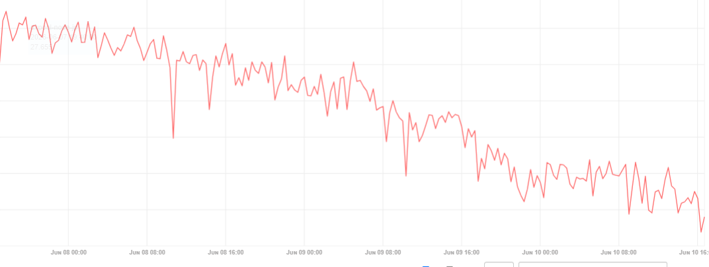

# Outbound 链路内存持续上涨分析（供项目方排查）

## 1. 文档目的与范围

本文基于以下信息，对节点运行期间内存持续上涨的问题进行整理：

- `test/doc/leak.md` 中的 Outbound pprof 图片；
- 当前代码中的 DHT outbound、序列化、消息队列和网络写出链路；
- 该节点属于挖矿/出块节点，矿工会向节点提交区块；
- 普通节点相对正常，而出块节点更容易观察到内存持续上涨。

本文只分析现象、证据和可能原因，用于向项目方确认设计行为和排查根因，不提供具体修改方案。

本文不讨论 `RandomXFactory`、RandomX VM 或 RandomX 缓存相关内存占用。

---

## 2. 当前观察到的现象

当前主要现象是：

1. 节点可以正常连接网络；
2. 节点可以正常接收矿工提交的区块；
3. 节点可以正常出块，网络中的其他节点也能够观察到新区块；
4. 普通节点未明显出现相同程度的持续内存上涨；
5. 出块节点运行期间，进程 RSS 持续上涨，且长时间没有明显回落；
6. pprof 中 Outbound 广播和消息编码调用栈对应的存活内存明显增长。

这些现象说明问题不一定是传统意义上的“对象失去引用后无法释放”，也可能是：

> Outbound 链路中的消息、编码 buffer、异步任务或发送队列仍然被合法引用，但其生命周期异常变长，导致表现类似内存泄漏。

---

## 3. `leak.md` 图片提供的直接证据

### 3.1 图片 `img_6.png`


该图片中可以看到：

- `tari_comms_dht::outbound::broadcast::BroadcastTask<S>::handle` 对应约 `326.50MB`；
- 上层调用链出现 `tower::util::oneshot::Oneshot::poll`；
- Outbound 广播异步任务对应的存活内存已经比较明显。

该图片说明，在较早采样时间点，已经有大量仍然存活的内存是在 Outbound 广播调用过程中分配的。

### 3.2 图片 `img_7.png`


后续采样中可以看到：

- `BroadcastTask<S>::handle` 对应的存活内存增长到约 `2.01GB`；
- `futures_util::stream::for_each::ForEach::poll` 对应约 `1.94GB`；
- 调用链仍然集中在 `tower::util::Oneshot`、`BroadcastTask::handle` 和异步 stream 处理流程。

从约 `326.50MB` 增长到约 `2.01GB`，说明与 Outbound 广播调用栈相关的存活内存随运行时间显著增加。

### 3.3 图片 `img_8.png`



该图片反映运行期间某项内存相关指标持续发生趋势性变化。

由于图片中没有完整展示指标名称、单位和方向，不能只根据曲线形状判断它是 RSS、剩余内存还是其他指标。因此该图片可以作为“运行期间内存状态持续变化”的辅助证据，但不能单独用于判断具体代码根因。

---

## 4. pprof 调用栈应该如何理解

pprof 将存活内存归因到：

```text
tari_comms_dht::outbound::broadcast::BroadcastTask<S>::handle
tower::util::oneshot::Oneshot::poll
futures_util::stream::for_each::ForEach::poll
prost::Message::encode_to_vec / to_encoded_bytes
```

这里必须区分两个概念：

### 4.1 分配来源

pprof 调用栈说明内存最初是在 `BroadcastTask`、序列化或相关异步调用过程中分配的。

### 4.2 当前持有位置

pprof 调用栈不一定说明这些内存当前仍由 `BroadcastTask` Future 自身直接持有。

例如：

1. `serialize.rs` 创建编码后的 `Bytes`；
2. `Bytes` 被移动到 `OutboundMessage`；
3. `OutboundMessage` 被放入 per-peer outbound queue；
4. 编码 buffer 最终由队列持有；
5. pprof 仍可能把该 buffer 归因到最初执行编码的调用栈。

因此，`BroadcastTask::handle` 和 `encode_to_vec` 是明确的分配热点，但最终没有释放这些分配的对象，可能位于后续消息队列或网络发送链路。

---

## 5. 挖矿节点出块后的 Outbound 调用链

矿工通过 gRPC 向节点提交区块：

```text
applications/minotari_node/src/grpc/base_node_grpc_server.rs
    submit_block
        ↓
LocalNodeCommsInterface::submit_block
        ↓
InboundNodeCommsHandlers 添加并验证区块
        ↓
如果 BlockAddResult 为 Ok 或 ChainReorg
        ↓
OutboundNodeCommsInterface::propagate_block
        ↓
BaseNodeService::spawn_handle_outbound_block
        ↓
handle_outbound_block
        ↓
OutboundMessageRequester::propagate
        ↓
BroadcastTask::handle
        ↓
SerializeMiddleware::call
        ↓
MessagingProtocol / per-peer outbound queue
        ↓
Forward
        ↓
Yamux/TCP
```

关键代码行为如下。

### 5.1 成功添加的本地区块会触发传播

在 `base_layer/core/src/base_node/comms_interface/inbound_handlers.rs` 中：

```rust
let should_propagate = match &block_add_result {
    BlockAddResult::Ok(_) => true,
    BlockAddResult::BlockExists => false,
    BlockAddResult::OrphanBlock => false,
    BlockAddResult::ChainReorg { .. } => true,
};
```

如果需要传播，会调用：

```rust
self.outbound_nci.propagate_block(new_block_msg, exclude_peers).await
```

对于矿工向本节点提交并成功添加的区块，`source_peer` 为空，因此不会因为来源 peer 而排除某个远端节点。

### 5.2 区块传播任务通过独立 Tokio task 启动

在 `base_layer/core/src/base_node/service/service.rs` 中：

```rust
fn spawn_handle_outbound_block(&self, new_block: NewBlock, excluded_peers: Vec<NodeId>) {
    let outbound_message_service = self.outbound_message_service.clone();
    task::spawn(async move {
        let result = handle_outbound_block(outbound_message_service, new_block, excluded_peers).await;
        // ...
    });
}
```

每次收到需要传播的区块，都会启动一个独立任务处理 Outbound 区块传播。

### 5.3 区块传播使用 DHT `Propagate`

`handle_outbound_block` 最终调用：

```rust
outbound_message_service
    .propagate(
        NodeDestination::Unknown,
        OutboundEncryption::ClearText,
        exclude_peers,
        OutboundDomainMessage::new(&TariMessageType::NewBlock, ...),
        "Outbound new block from base node".to_string(),
    )
    .await;
```

当 `NodeDestination::Unknown` 时，DHT 会随机选择连接进行传播。

当前 `DhtConfig::default()` 中：

```rust
propagation_factor: 20
```

因此，在连接数量足够时，一次新区块传播可能为最多约 20 个目标 peer 创建发送消息。

### 5.4 `NewBlock` 不是完整 Block，但仍然包含可变长度数据

传播使用的 `NewBlock` 包含：

- block header；
- coinbase kernels；
- coinbase outputs；
- 区块中交易 kernel excess signature 的集合。

因此它通常小于完整 Block，但大小仍会受到区块交易数量等因素影响。

---

## 6. 为什么挖矿节点更容易暴露该问题

普通节点和出块节点都可能使用 Outbound 链路，但出块节点具有更明确、持续的消息生产来源。

### 6.1 每个成功出块都会主动产生一轮传播

如果平均约 5 分钟产生一个区块，则每个成功区块都会触发一次 `NewBlock` 传播。

一次传播不是只产生一条底层发送消息，而是：

```text
1 个 NewBlock
    × 被选择的目标 peer 数量
    × 每个 peer 独立的 DHT envelope 编码
    × 每个 peer 独立的发送状态和 reply channel
```

如果目标 peer 数量约为 20，则每次成功出块最多可能生成约 20 份目标消息。

### 6.2 出块会重复命中同一批慢 peer

DHT 从当前连接中选择 peer。如果某些连接长期存在但发送速度很慢，它们可能在多次传播中被重复选中。

每次新区块传播都可能继续向这些 peer 的发送链路追加消息。

### 6.3 普通节点也可能传播区块，但消息来源不同

普通节点收到远端新区块并成功添加后，也可能继续传播该区块，但会排除来源 peer。

出块节点的本地区块没有来源 peer，因此传播时不存在该排除项。除此之外，出块节点还可能同时承担：

- 矿工或矿池相关接口请求；
- 高频获取 block template；
- 本地提交新区块；
- 正常区块同步；
- 交易和其他 DHT 消息处理。

需要注意：普通 share 或 block template 请求本身不一定进入 `NewBlock` 传播链路。只有提交并被节点成功接受的区块，才会触发上述新区块传播逻辑。如果内存增长与每个 share 而不是成功出块相关，需要项目方进一步确认是否存在其他 Outbound 消息来源。

---

## 7. BroadcastTask 中可能产生的放大效应

`BroadcastTask::handle` 当前逻辑为：

```rust
self.service
    .call_all(stream::iter(messages))
    .unordered()
    .filter_map(|result| future::ready(result.err()))
    .for_each(|err| {
        warn!(target: LOG_TARGET, "Error when sending broadcast messages: {err}");
        future::ready(())
    })
    .await;
```

### 7.1 `.unordered()` 会同时推进本轮目标消息

`messages` 包含本轮传播为各目标 peer 创建的 `DhtOutboundMessage`。

`.unordered()` 会并发推进这些消息的 service Future。该行为有利于降低正常广播延迟，但也会使本轮传播中的多个目标消息同时进入后续链路。

### 7.2 `poll_ready()` 没有体现真实下游容量

`BroadcastMiddleware` 和 `SerializeMiddleware` 的 `poll_ready()` 均直接返回：

```rust
Poll::Ready(Ok(()))
```

因此 tower service 在这两层无法感知后续 per-peer 队列、网络连接或 socket 的真实压力。

### 7.3 广播完成不等于网络发送完成

`generate_send_messages` 在生成目标消息后，会向上层返回：

```rust
SendMessageResponse::Queued(...)
```

这表示消息已生成或已排队，并不代表所有目标 peer 已经实际收到消息。

因此：

- 本节点正常完成出块处理；
- 上层收到 `Queued` 或发送成功状态；
- 网络中部分节点收到新区块；

这些现象都不能证明所有被选择的 peer 已经完成底层网络写出。

---

## 8. 每个目标 peer 都会产生独立编码 buffer

在 `generate_send_messages` 中，原始消息 body 会被克隆到每个目标 `DhtOutboundMessage`：

```rust
body: body.clone()
```

此时 `Bytes`/`BytesMut` 的克隆可能共享底层内存，成本相对较低。

但在 `SerializeMiddleware::call` 中，每个目标消息都会构建自己的 DHT envelope：

```rust
let envelope = DhtEnvelope::new(dht_header, body.into());
let body = Bytes::from(envelope.to_encoded_bytes());
```

`to_encoded_bytes()` 会为该目标 peer 的完整 envelope 创建新的编码 buffer。

因此每轮区块传播会产生：

```text
目标 peer 数量 × 独立编码后的 DHT envelope
```

这与 `leak.md` 中 `prost::Message::encode_to_vec` 或 `to_encoded_bytes` 对应存活内存持续增长的现象一致。

需要强调：

> 编码函数本身不一定存在泄漏。更可能的情况是编码结果进入后续发送链路后长期没有被释放，因此 pprof 持续将存活内存归因到编码调用栈。

---

## 9. Outbound 链路中的无界队列

当前代码中存在多处无界队列。

### 9.1 Base node 区块传播入口

`BaseNodeServiceInitializer` 创建：

```rust
let (outbound_block_sender_service, outbound_block_stream) = mpsc::unbounded_channel();
```

待传播的 `NewBlock` 会先进入该无界队列。

Base node service 收到后通过 `spawn_handle_outbound_block` 启动独立任务。

### 9.2 DHT Outbound 请求入口

`OutboundMessageRequester` 使用：

```rust
mpsc::UnboundedSender<DhtOutboundRequest>
```

上游请求通过无界 channel 进入 DHT outbound pipeline。

### 9.3 每个 peer 的 outbound queue

`MessagingProtocol` 为每个 peer 创建：

```rust
let (msg_tx, msg_rx) = mpsc::unbounded_channel();
```

并在：

```rust
active_queues: HashMap<NodeId, mpsc::UnboundedSender<OutboundMessage>>
```

中保存每个 peer 对应的 sender。

如果某个 peer 消费速度长期低于消息进入速度，该 peer 的 queue 可以持续保留后续 `OutboundMessage`。

### 9.4 retry queue

Messaging protocol 还创建：

```rust
let (retry_queue_tx, retry_queue_rx) = mpsc::unbounded_channel();
```

连接结束后，per-peer queue 中剩余消息可能进入 retry queue，再次尝试发送。

### 9.5 多个无界阶段共同存在时的特征

无界队列不一定会主动造成问题。只有当长期存在：

```text
消息生产速度 > 消息实际完成或释放速度
```

队列才会持续增长。

但多个无界阶段共同存在时，系统缺少明确的容量边界，因此慢 peer、网络阻塞或异常任务可能被延迟暴露为持续 RSS 上涨。

---

## 10. 最值得怀疑的最终持有位置：per-peer 发送链路

每个 peer 的 `OutboundMessaging` 会将自己的无界队列转换为 stream，并交给 `Forward`：

```rust
Forward::new(stream, sink.sink_map_err(Into::into)).await
```

`Forward` 的核心流程依赖：

```rust
poll_ready
start_send
poll_flush
```

如果底层 sink 长期不能 ready 或 flush，`Forward` 会保持 `Pending`。

可能出现这种状态的情况包括：

- 对端进程仍存活，但没有及时读取该 messaging substream；
- 对端节点负载过高，消息处理速度长期不足；
- Yamux 子流窗口或连接级流控限制；
- TCP 发送缓冲区长期填满；
- 网络设备或防火墙静默丢包，但操作系统暂未判断连接断开；
- 连接仍被视为可用，因此不会触发断连清理；
- 某些 peer 的实际消费能力长期小于本节点向其发送消息的速度。

如果一个 peer 的 `Forward` 长期无法推进：

1. 当前正在写入的消息被 `Forward` 持有；
2. 该 peer 后续消息保留在其无界 queue 中；
3. 新出块继续产生新的传播消息；
4. 如果该 peer 再次被选中，它的 queue 会继续增长；
5. 编码后的 buffer、消息状态和 reply channel 继续存活；
6. RSS 表现为持续上涨。

这只需要一个或少数 peer 出现问题，并不要求所有 peer 都发送失败。

---

## 11. 为什么网络收到新区块仍不能排除该问题

网络中观察到新区块，只能证明：

- 至少一个目标 peer 收到了新区块；或者
- 新区块通过其他传播路径到达了网络。

它不能证明：

- 本轮选择的所有 peer 都收到新区块；
- 每个 peer 的 per-peer outbound queue 都为空；
- 每个 Yamux messaging substream 都能够正常 flush；
- 所有编码后的目标消息都已经释放。

此外，在 `OutboundMessaging` 中，消息从 per-peer queue 取出后会先调用：

```rust
out_msg.reply_success();
```

然后才把 `out_msg.body` 交给 `Forward`。

这意味着该成功状态更接近“消息已从本地 per-peer queue 取出并交给发送 stream”，不一定等同于“对端已经收到并处理该消息”。

因此，上层发送结果、正常出块和网络可见新区块，都不能完全排除少数 peer 的底层写出长期阻塞。

---

## 12. 为什么内存可能持续上涨且长期不下降

如果某个 peer 完全阻塞，则该 peer 的积压变化接近：

```text
积压新增量 = 每轮传播分配给该 peer 的消息数量
```

如果某个 peer 并非完全阻塞，而是长期偏慢，则：

```text
积压变化量 = 消息进入速度 - 实际发送释放速度
```

只要平均值长期大于零，队列和对应内存就会持续增长。

因此，即使消息偶尔能够发送、节点没有完全断连、区块也能传播到网络，仍然可能出现单边增长而没有明显回落。

---

## 13. 10 秒 Outbound pipeline 超时为什么不能直接排除堆积

`comms/core/src/pipeline/outbound.rs` 对单个 outbound pipeline task 设置了：

```rust
time::timeout(Duration::from_secs(10), pipeline.oneshot(msg))
```

同时 Outbound pipeline 使用 `BoundedExecutor` 限制并发任务数量，P2P 默认配置中：

```rust
max_concurrent_outbound_tasks: 100
```

这些机制能够限制同时运行的 DHT outbound pipeline task，并终止执行时间过长的 pipeline Future。

但仍存在以下需要项目方确认的语义：

1. pipeline task 在 10 秒内可能已经完成序列化，并把编码后的 `OutboundMessage` 移交到后续无界队列；
2. pipeline Future 完成或被取消，不代表已经移交到 messaging queue 的消息也会被取消；
3. `SinkService<UnboundedSender>` 的发送会立即返回，不会等待真实网络发送完成；
4. 因此 pipeline task 的 10 秒超时可能限制任务本身，却不能限制已经进入 per-peer queue 的编码消息生命周期。

这可以解释为什么 pprof 分配栈位于 `BroadcastTask/serialize`，但最终积压可能发生在更下游。

---

## 14. 当前证据支持程度

### 14.1 已有代码和图片直接支持的事实

1. `BroadcastTask::handle` 相关调用栈对应的存活内存从约 `326.50MB` 增长到约 `2.01GB`；
2. Outbound 广播会将一条业务消息展开为多个目标 peer 消息；
3. `NewBlock` 传播默认可能选择最多约 20 个 peer；
4. 每个目标 peer 都会执行独立的 DHT envelope 编码；
5. Base node outbound block、DHT outbound、per-peer outbound 和 retry 均存在无界队列；
6. per-peer 网络写出通过 `Forward` 等待 sink ready/flush；
7. 出块成功后会主动触发 `NewBlock` 传播；
8. 上层“Queued/Success”不等价于所有目标 peer 已完成网络接收。

### 14.2 高概率推测

1. 存活内存主要是为目标 peer 创建的编码 buffer 和发送状态；
2. 这些对象在后续队列或发送链路中生命周期异常变长；
3. 一个或少数慢 peer 足以导致对应 per-peer queue 长期增长；
4. 挖矿节点持续产生新区块传播，因此比普通节点更容易持续向慢 peer 追加消息；
5. `prost::encode_to_vec` 是内存放大和分配热点，而不一定是独立泄漏源。

### 14.3 当前证据尚不能确认的事项

1. 积压是否主要集中在某一个 peer；
2. `Forward` 是否真实存在数小时不推进的情况；
3. 阻塞主要发生在 `poll_ready`、`poll_flush`、Yamux 还是 TCP；
4. retry queue 是否占据主要内存；
5. 内存增长是否严格对应每次成功出块；
6. 普通 share、block template 请求或其他矿池请求是否间接产生额外 Outbound 消息；
7. pprof 中约 `2.01GB` 的存活内存当前具体由哪个队列或 Future 持有；
8. 是否存在某类 peer、某种网络环境或特定连接状态更容易触发该问题。

---

## 15. 可能原因的优先级判断

以下排序仅表示根据现有证据的怀疑程度，不表示已经确认。

### 第一优先级：少数 peer 的 per-peer outbound queue 长期积压

理由：

- per-peer queue 为无界队列；
- `Forward` 对单个 peer 顺序写出；
- 一个慢 peer 不影响其他 peer 正常收到区块；
- 符合“节点正常出块、网络也收到区块，但本地内存持续上涨”的现象。

### 第二优先级：下游写出长期 Pending，连接未被判断为断开

理由：

- `Forward` 依赖底层 sink 的 ready/flush；
- TCP/Yamux 连接可能在对端不消费时仍保持连接状态；
- 只要 handler 不结束，队列清理和 retry 流程就不会开始。

### 第三优先级：区块传播 fan-out 与逐 peer 编码放大积压

理由：

- 每个成功区块会传播到多个目标 peer；
- 每个 peer 都会生成独立 DHT envelope buffer；
- 与 pprof 中 `BroadcastTask` 和 `encode_to_vec` 的增长一致。

该项更像放大因素，而不一定是最终阻塞根因。

### 第四优先级：多个无界入口和异步任务共同造成积压

理由：

- 区块传播入口、DHT outbound、per-peer queue 和 retry queue 均缺少容量边界；
- `spawn_handle_outbound_block` 为每个区块创建独立任务；
- 如果任何后续阶段持续慢于生产阶段，内存会在某个无界阶段积累。

### 第五优先级：某类出块相关消息尺寸或频率高于预期

理由：

- `NewBlock` 包含可变长度的 kernel excess signatures；
- 区块内容、交易数量、传播 peer 数量都会影响单轮分配量；
- 如果实际内存增长速度远高于“每 5 分钟一轮 NewBlock 传播”能够解释的范围，可能还存在其他高频消息来源。

---

## 16. 建议向项目方确认的问题

以下问题用于确认当前行为是否符合项目设计。

### 16.1 关于 pprof 和已知问题

1. 项目方是否观察到过 `BroadcastTask::handle`、`tower::util::Oneshot` 或 `prost::Message::encode_to_vec` 对应存活内存持续增长？
2. 是否存在已知的 slow peer、Yamux flow control 或 messaging outbound queue 积压问题？
3. pprof 中归因到 `BroadcastTask::handle` 的大块存活内存，项目方是否认为可能已被移动到后续 per-peer queue？

### 16.2 关于发送完成语义

1. `SendMessageResponse::Queued` 的设计语义是否只表示消息已排队？
2. `OutboundMessaging` 在消息刚从 queue 取出时调用 `reply_success()`，是否有意表示“已交给发送 stream”，而不是“已完成 socket flush”？
3. 上层 `MessageSendState` 是否可能在底层网络写出阻塞前已经显示成功？
4. 项目方如何判断一条 DHT 消息已经真正完成网络写出？

### 16.3 关于 per-peer queue

1. `active_queues` 中每个 peer 使用无界 channel 是否是有意设计？
2. 某个 peer 的 `Forward` 长期 Pending 时，后续消息是否会无限保留在该 peer queue？
3. 当前是否存在监控单个 peer queue 长度或最老消息年龄的方式？
4. 是否存在设计上的机制，用于识别“连接仍存在但 messaging substream 长期无法写出”的 peer？

### 16.4 关于连接和 Forward

1. `Forward` 在 `poll_ready` 或 `poll_flush` 长期 Pending 时，底层是否存在默认超时？
2. Yamux 或 TCP 层在对端长期不读取数据时，通常多久能够判断连接失效？
3. 是否可能出现连接 liveness 正常，但某个 messaging substream 长期无法写出的状态？
4. `conn.on_disconnect()` 和 `remote_stream.next()` 是否能够覆盖网络黑洞、对端不读或 Yamux 窗口耗尽的情况？

### 16.5 关于出块传播

1. 本地成功提交区块后，`NewBlock` 是否始终按 `propagation_factor` 传播？
2. 默认 `propagation_factor = 20` 是否是当前生产网络推荐值？
3. 本地出块没有 `source_peer`，是否意味着它相比转发远端区块更容易发送到更多目标 peer？
4. `NewBlock` 在典型和极端区块下的编码大小大约是多少？
5. 项目方是否观察到出块节点相比普通节点有更高的 outbound queue 或 RSS？

### 16.6 关于其他无界队列

1. Base node 的 `outbound_block_stream` 使用无界 channel 是否可能积压？
2. DHT outbound requester 的无界 channel 是否有其他隐含背压机制？
3. retry queue 在 peer 长期不可用或频繁断连时，是否可能持续增长？
4. pipeline 的 10 秒超时是否会清理已经进入 messaging per-peer queue 的消息？

### 16.7 关于矿工和 share 行为

1. 未形成有效区块的 share 是否会触发任何 DHT outbound 消息？
2. 高频 block template 请求是否可能间接触发网络请求或广播？
3. 是否存在矿池、merge mining proxy 或节点服务在每次 share 后发送额外网络消息的路径？
4. 如果只有成功出块触发传播，项目方认为每约 5 分钟一轮传播是否足以造成当前观察到的内存增长速度？

---

## 17. 提交项目方时建议附带的数据

为了让项目方能够判断上述假设，问题报告中建议包含以下事实数据：

1. `img_6.png` 和 `img_7.png` 两次 pprof 的采样时间间隔；
2. 两次采样期间成功出块数量；
3. 同期 RSS 起始值、结束值和增长速度；
4. 同期连接 peer 数量；
5. `propagation_factor`、`broadcast_factor` 和 `max_concurrent_outbound_tasks` 实际配置；
6. 是否存在固定 peer 长期连接；
7. 出块节点与普通节点使用的配置差异；
8. 内存增长是否在停止矿工提交后停止；
9. 内存增长是否与成功出块时间点呈阶梯关系；
10. 是否存在 Outbound pipeline timeout、连接断开、Yamux 或 socket 写入异常日志。

---

## 18. 当前综合判断

基于 `leak.md` 的 Outbound pprof 图片和当前代码，最值得项目方确认的根因方向是：

> 出块节点成功添加新区块后，会通过 DHT `Propagate` 将 `NewBlock` 展开为多个目标 peer 消息，并为每个 peer 独立编码 DHT envelope。编码后的消息进入后续无界发送链路。如果一个或少数 peer 的 messaging substream 长期无法写出，或者实际消费速度持续低于新区块及其他消息的生产速度，这些消息及其编码 buffer 会在 per-peer queue、retry queue或相关异步状态中长期存活。pprof 因此将大量存活内存归因到 `BroadcastTask::handle` 和编码调用栈，而节点本身仍可以正常出块，网络中的其他正常 peer 也仍然可以收到新区块。

现有证据能够确认 Outbound 广播和编码链路是主要存活内存来源，但尚不能仅凭当前图片确认最终积压位置，也不能确认问题是单个 peer 永久阻塞、多个 peer 长期偏慢、retry 积压，还是其他出块相关 Outbound 消息共同造成。
